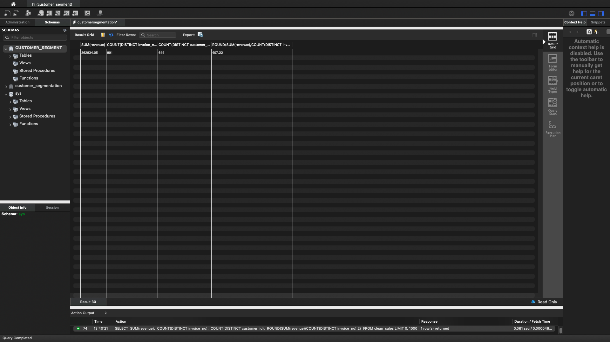
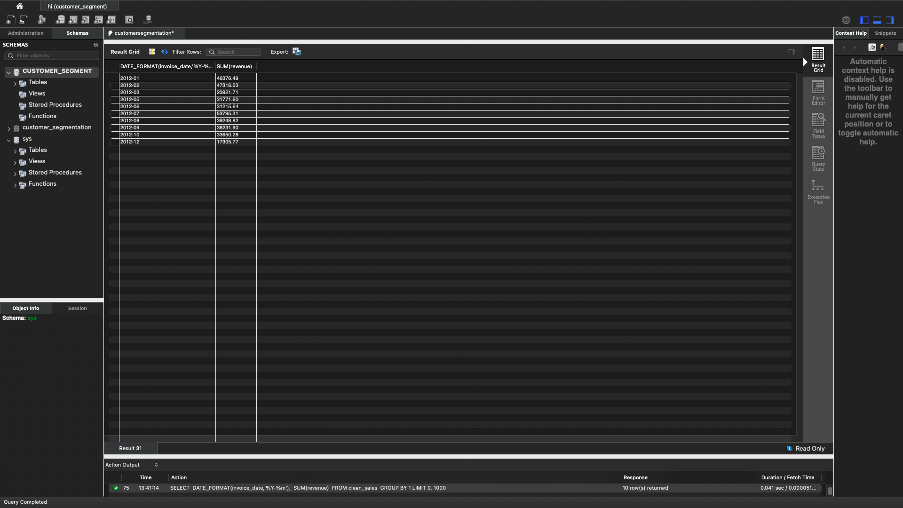
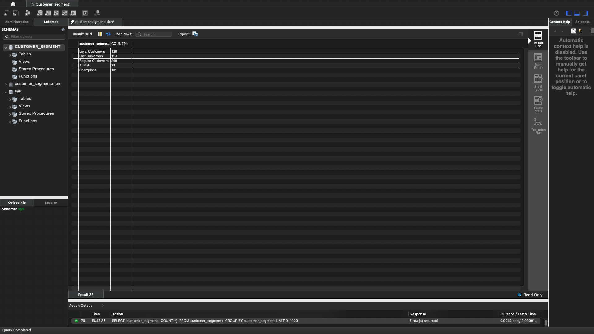
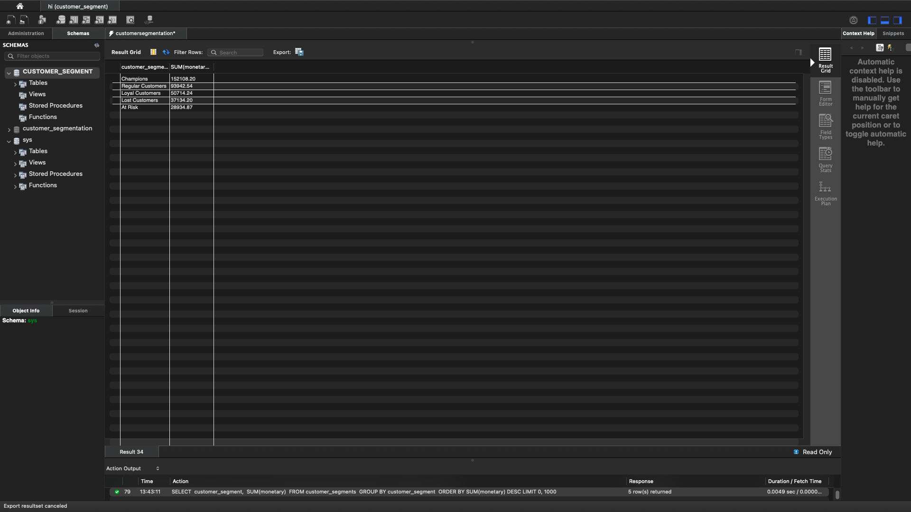
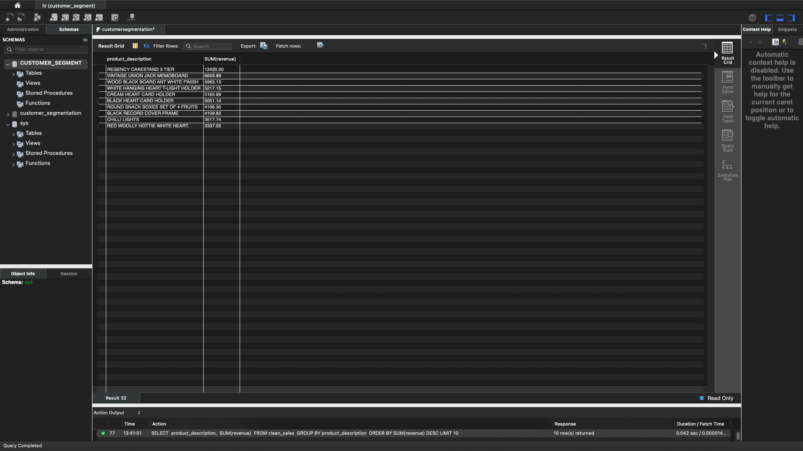
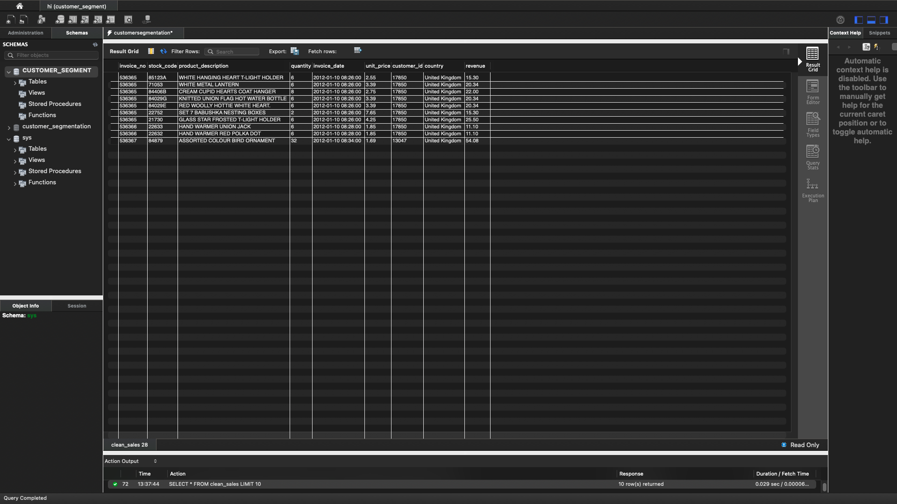

# Customer Segmentation using SQL (RFM Analysis)

## Project Overview

This project analyzes customer purchasing behavior using SQL and the RFM (Recency, Frequency, Monetary) framework. The goal is to segment customers based on their purchasing habits and generate actionable business recommendations to improve customer retention, marketing effectiveness, and revenue.

---

## Business Problem

Businesses often struggle to identify their most valuable customers and determine which customers are at risk of churning.

This project answers questions such as:

- Who are our most valuable customers?
- Which customers are at risk of leaving?
- Which customer segments generate the most revenue?
- What business actions should be taken for each segment?

---

## Dataset

The dataset contains retail transaction data including:

- Customer ID
- Invoice Number
- Purchase Date
- Product Description
- Quantity
- Unit Price
- Revenue

---

## Tools Used

- MySQL
- SQL
- GitHub

---

## SQL Skills Demonstrated

- Common Table Expressions (CTEs)
- Aggregate Functions
- CASE Statements
- Window Functions
- GROUP BY
- ORDER BY
- NTILE()
- Date Functions
- RFM Analysis
- Customer Segmentation

---

## Project Workflow

Retail Sales Data

↓

Data Cleaning

↓

Customer-Level Aggregation

↓

RFM Score Calculation

↓

Customer Segmentation

↓

Business Recommendations

---

# Key Results

## Business KPIs



---

## Monthly Revenue



---

## Customer Segments



---

## Revenue by Segment



---

## Top Products



---

## Data Preview



---

# Business Recommendations

- Reward Champion customers with loyalty incentives and exclusive offers.
- Target At Risk customers using personalized promotions and win-back campaigns.
- Encourage New Customers to make repeat purchases through onboarding offers.
- Continue nurturing Loyal Customers with cross-selling and upselling opportunities.
- Prioritize high-performing products and customer segments to maximize long-term revenue.

---

# Repository Contents

```
customer-segmentation-SQL
│
├── README.md
├── customer_segmentation_analysis.sql
└── screenshots
    ├── Overall KPIs.png
    ├── Monthly Revenue.png
    ├── Customer Segments.png
    ├── Revenue by Segment.png
    ├── Top Products.png
    └── Data Preview.png
```

---

# Author

**Asjad Siddiqui**

Business Economics | SQL | Excel | Financial Analysis | Business Analytics
